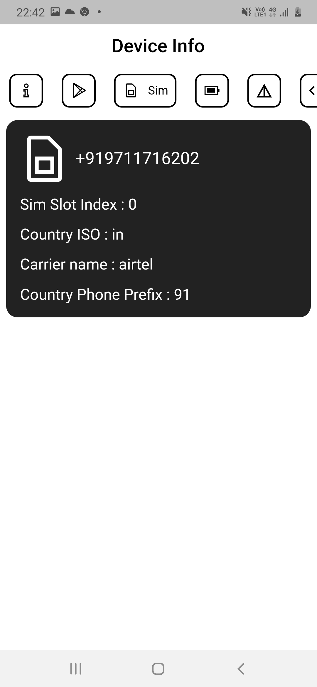

# Device Info
A mobile application built for android using dart and flutter used to view device details, battery, apps, sim details and many more.

## How to Use 

**Step 1:**

Download or clone this repo by using the link below:

```
https://github.com/spiderxm/device_info.git
```

**Step 2:**

Go to project root and execute the following command in console to get the required dependencies: 

```
flutter pub get 
```

**Step 3:**

```
flutter run lib/main.dart
```

## Features:

* Device Info
* Installed Applications
* Battery and its state
* Sim Details
* Device features 


### Up-Coming Features:

* Connectivity Status


### Folder Structure
Here is the core folder structure which flutter provides.

```
flutter-app/
|- android
|- build
|- ios
|- lib
```

Here is the folder structure we have been using in this project

```
lib/
|- models/
|- screens/
|- widgets/
|- main.dart
```

# Screenshots
</img>
</img>
</img>
</img>
</img>

## License

<!-- Distributed under the MIT License. See `LICENSE` for more information. -->
Code copyright 2021 the authors. Code released under the MIT License.


## Contact


Mrigank Anand - [linkedIn/mrigankanand](https://www.linkedin.com/in/mrigankanand) - mrigank.anand52@gmail.com

Project Link: [Github](https://github.com/spiderxm/device_info)
